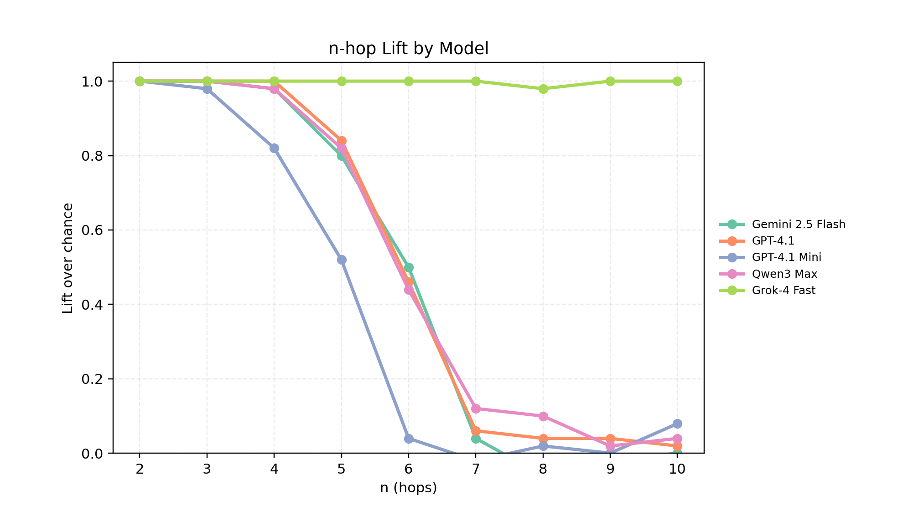

# n-hop Composition Benchmark

This repo tests n-hop reasoning without candidates. Each item is a bag of facts covering m disjoint chains. The model must compose the correct tail using only those facts.

**Key pieces**
- `scripts/generate.py` and `scripts/evaluate.py` implement the pipeline
- `scripts/` wraps sweeps, plotting, and diagnostics
- `data/testsets/` ships reusable splits, including the legacy m=4 set (`benchmark_n{4,6,8}_m4_seed13.jsonl`) and the roster set (`benchmark_n{2..10}_m6_seed7.jsonl`)
- [`RESULTS.md`](RESULTS.md) logs baseline vs. structured reasoning runs and roster sweeps

**Shorthand**
- EM = exact match accuracy
- Lift = `(accuracy - 1/m) / (1 - 1/m)`
- Structured reasoning prompt = template with step slots before the final answer

## What's included

- `scripts/generate.py`: emits n-hop chains with balanced relation counts across m distractors
- `scripts/evaluate.py`: queries the composed answer token using OpenAI or OpenRouter APIs (records `model` and `dataset` metadata per example)
- `scripts/sweep.py`: sweep utility (`runs/benchmark/<tag>/` layout: data/, results/, plots/, results.csv); supports `--dataset_dir` to reuse pre-generated JSONL splits and `--sleep` to throttle API calls
- `scripts/run_sweep.py`: orchestrates sweeps, plotting, and reporting
- `scripts/plot_sweep.py`: renders accuracy and lift curves vs. n
- `scripts/run_diagnostics.py`: quick variant runner (control, ablate, baseline, optional reasoning)
- `scripts/analyze_errors.py`: aggregates non-EM diagnostics for completed runs
- `tests/`: smoke tests for generation and evaluation

## Data format (JSONL)

Benchmark item example:
```json
{
  "id": "BENCH-000123",
  "type": "benchmark",
  "n": 5,
  "m": 8,
  "facts_bag": [["A_0001","f1","B_0100"], ..., ["D_0123","f4","E_0999"]],
  "question": "What is f4 of f3 of f2 of f1 of A_0001?",
  "answer_id": "E_0420",
  "answer_aliases": ["E_0420"]
}
```

## Parameters

- `--items`: number of instances to generate
- `--hops`: hop count n
- `--m`: number of chains mixed into the bag (balanced per relation; ≥4 recommended)
- `--M`: layer size (token pool per hop)
- `--id_width`: zero-padded width for token IDs (shorter IDs shrink prompt length)
- `--seed`: RNG seed
- `--ablate_inner --ablate_hop j`: optional ablation removing relation f_j across all chains to create ambiguity baselines
- `--reasoning_steps`: add structured step-by-step slots to the prompt so the model must spell out each hop before answering

## Quickstart

Prereqs: Python 3.9+, `pip install openai python-dotenv`. Create a `.env` with:
```
OPENAI_API_KEY=sk-...
```

Generate and evaluate a small dataset:
```bash
python scripts/generate.py --items 200 --hops 5 --m 8 --M 512 --seed 123 --out data/benchmark.jsonl
python scripts/evaluate.py --in data/benchmark.jsonl --out runs/benchmark_run.jsonl --model gpt-4.1-mini --temp 0.0 --max_output_tokens 16 | tee runs/benchmark_run.log
```

Sweep over n and m for a quick baseline:
```bash
python scripts/sweep.py --items 60 --hops 4,5,6,7,8 --m_list 4,8,12 --seeds 7,13

# With structured reasoning slots
python scripts/sweep.py --items 60 --hops 4,5,6,7,8 --m_list 4 --seeds 13,27 --reasoning_steps --max_output_tokens 64
```

### Shared test sets

To keep runs comparable, reuse the cached files under `data/testsets/` instead of synthesizing for every sweep:

- `benchmark_n{4,6,8}_m4_seed13.jsonl` — original public set (`seed=13`, `M=256`, `id_width=3`).
- `benchmark_n{2..10}_m6_seed7.jsonl` — roster set introduced in the latest runs (`seed=7`, `M=512`, `id_width=4`).

Example evaluation against the roster set:

```bash
python scripts/evaluate.py \
  --in data/testsets/benchmark_n2_m6_seed7.jsonl \
  --in data/testsets/benchmark_n3_m6_seed7.jsonl \
  ... \
  --in data/testsets/benchmark_n10_m6_seed7.jsonl \
  --model gpt-4.1 \
  --temp 0.0 --max_output_tokens 16 \
  --order_trials 1 --concurrency 4 \
  --out runs/benchmark/gpt-4.1_m6.jsonl
```

Pass `--dataset_dir data/testsets` to `scripts/sweep.py` so every combination reads from the cached filenames (`benchmark_n{n}_m{m}_seed{seed}.jsonl`).

### Using OpenRouter models

`scripts/evaluate.py` routes through OpenRouter when these variables are present:

```
export OPENROUTER_API_KEY=sk-or-...
export OPENAI_BASE_URL=https://openrouter.ai/api/v1
export OPENAI_HTTP_REFERER=https://your.site
export OPENAI_X_TITLE="lllm-comp"
```

The client tries the Responses API first and falls back to Chat Completions if needed.

## Experiment runner

Use `scripts/run_sweep.py` to manage sweeps, plots, and indexing:
```bash
python scripts/run_sweep.py run --config configs/benchmark_small.json
python scripts/run_sweep.py plot --summary runs/benchmark/sweep_YYYYMMDD_HHMMSS/results.csv --outdir runs/benchmark/sweep_YYYYMMDD_HHMMSS/plots --label gpt-4.1-mini
python scripts/run_sweep.py report --summary runs/benchmark/sweep_YYYYMMDD_HHMMSS/results.csv
```

Runs are stored under `runs/benchmark/sweep_<timestamp>/` with subfolders `data/`, `results/`, `plots/`, and an aggregate `results.csv`.

## Diagnostics and baselines

- Order invariance: the evaluator accepts `--order_trials T` to reshuffle the facts bag per item.
- Concurrency: `--concurrency`, `--max_retries`, and `--retry_backoff` control request parallelism and retry behaviour.
- Baseline: `--baseline pointer_f_n1` selects the tail of the first f_{n-1} fact (chance ≈ 1/m).
- Ablation: `--ablate_inner --ablate_hop j` in the generator removes the j-th relation, pushing accuracy towards the baseline.
- Diagnostics: `scripts/run_diagnostics.py --items 60 --n 6 --m 8 --M 256 --seed 7 --variants control,ablate,baseline --reasoning_steps` records EM/lift per variant while also logging reasoning compliance.

## Plots

- `scripts/plot_sweep.py` still writes per-sweep figures into each run directory.
- Shared analysis artefacts live under `plots/`. The latest roster comparison (gpt-4.1, gpt-4.1-mini, qwen3-max, gemini-2.5-flash, grok-4-fast) is captured below:



Lift is normalized against the 1/m chance baseline; anything above 0 denotes better-than-random composition. Grok-4-fast remains perfect through n=10, while the other models degrade once hop depth exceeds six.

## Tests

Smoke tests validate end-to-end generation and evaluation:
```bash
python -m pytest -q tests/
```

Run the smoke test directly:
```bash
python -m pytest -q tests/test_benchmark.py
```

## Notes

- `scripts/sweep.py` and `scripts/run_sweep.py` default to this bag-of-facts benchmark.
- Prompts present only the shuffled facts and a final answer line.
- Shared evaluation sets live under `data/testsets/`; add new JSONL files there when you need additional seeds or hop counts.
